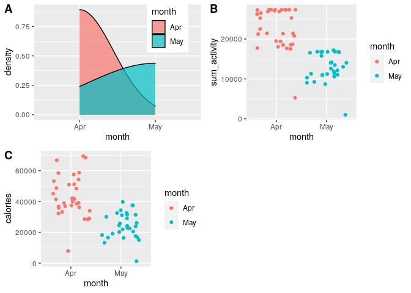
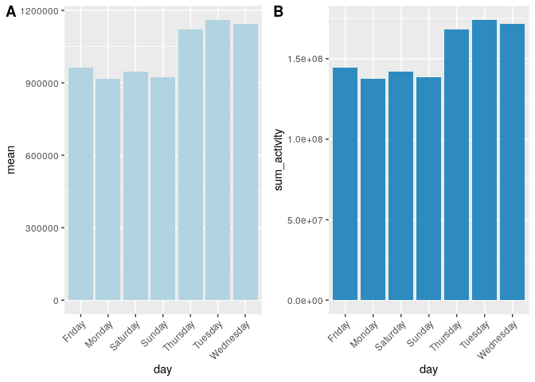
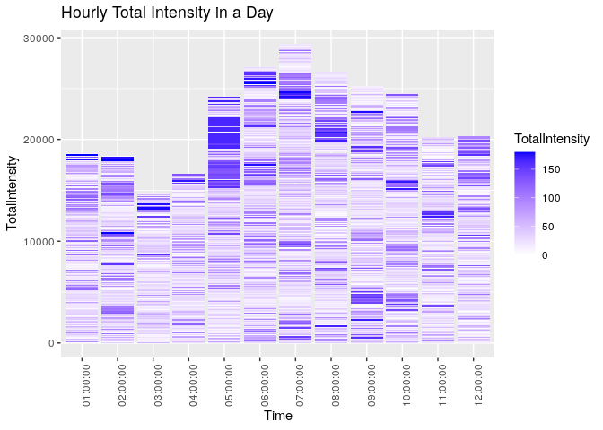
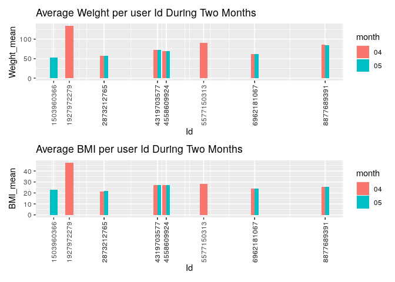

## Table of Content:
- Brief introduction
- EDA
- Main Question to Answer
- Conclusion


## Breif introduction about the dataset:
Fitbit dataset consist of 30 Fitbit users records between 03.12.2016-05.12.2016 this data were collected by respondents to a distributed survey via Amazon Mechanical Turk. Fitbit users have submitted there personal tracking data.

#### Dataset Source:
- [kaggle](https://www.kaggle.com/arashnic/fitbit)


## Main Question to answer in this Report :
1. How much active the users using fitbit tracker? 
2. What factors could affect the activity level of the user? 
3. Is there any improvement in the users weight? 


## read data 
- Note:I will be useing 3 different datasets in this analysis:
1. dailyActivity_merged.csv
2. hourlyIntensities_merged.csv
3. weightLogInfo_merged.csv


```r
df_fitness <- read.csv(file = '~/Documents/My_website/content/post/2022-02-09-fitbit-fitness-tracker-analysis/data/dailyActivity_merged.csv')
```


## Exploring the dataset 

```r
knitr::kable(head(df_fitness))
```


|         Id|ActivityDate | TotalSteps| TotalDistance| TrackerDistance| LoggedActivitiesDistance| VeryActiveDistance| ModeratelyActiveDistance| LightActiveDistance| SedentaryActiveDistance| VeryActiveMinutes| FairlyActiveMinutes| LightlyActiveMinutes| SedentaryMinutes| Calories|
|----------:|:------------|----------:|-------------:|---------------:|------------------------:|------------------:|------------------------:|-------------------:|-----------------------:|-----------------:|-------------------:|--------------------:|----------------:|--------:|
| 1503960366|4/12/2016    |      13162|          8.50|            8.50|                        0|               1.88|                     0.55|                6.06|                       0|                25|                  13|                  328|              728|     1985|
| 1503960366|4/13/2016    |      10735|          6.97|            6.97|                        0|               1.57|                     0.69|                4.71|                       0|                21|                  19|                  217|              776|     1797|
| 1503960366|4/14/2016    |      10460|          6.74|            6.74|                        0|               2.44|                     0.40|                3.91|                       0|                30|                  11|                  181|             1218|     1776|
| 1503960366|4/15/2016    |       9762|          6.28|            6.28|                        0|               2.14|                     1.26|                2.83|                       0|                29|                  34|                  209|              726|     1745|
| 1503960366|4/16/2016    |      12669|          8.16|            8.16|                        0|               2.71|                     0.41|                5.04|                       0|                36|                  10|                  221|              773|     1863|
| 1503960366|4/17/2016    |       9705|          6.48|            6.48|                        0|               3.19|                     0.78|                2.51|                       0|                38|                  20|                  164|              539|     1728|


```r
str(df_fitness)
```

```
## 'data.frame':	940 obs. of  15 variables:
##  $ Id                      : num  1.5e+09 1.5e+09 1.5e+09 1.5e+09 1.5e+09 ...
##  $ ActivityDate            : chr  "4/12/2016" "4/13/2016" "4/14/2016" "4/15/2016" ...
##  $ TotalSteps              : int  13162 10735 10460 9762 12669 9705 13019 15506 10544 9819 ...
##  $ TotalDistance           : num  8.5 6.97 6.74 6.28 8.16 ...
##  $ TrackerDistance         : num  8.5 6.97 6.74 6.28 8.16 ...
##  $ LoggedActivitiesDistance: num  0 0 0 0 0 0 0 0 0 0 ...
##  $ VeryActiveDistance      : num  1.88 1.57 2.44 2.14 2.71 ...
##  $ ModeratelyActiveDistance: num  0.55 0.69 0.4 1.26 0.41 ...
##  $ LightActiveDistance     : num  6.06 4.71 3.91 2.83 5.04 ...
##  $ SedentaryActiveDistance : num  0 0 0 0 0 0 0 0 0 0 ...
##  $ VeryActiveMinutes       : int  25 21 30 29 36 38 42 50 28 19 ...
##  $ FairlyActiveMinutes     : int  13 19 11 34 10 20 16 31 12 8 ...
##  $ LightlyActiveMinutes    : int  328 217 181 209 221 164 233 264 205 211 ...
##  $ SedentaryMinutes        : int  728 776 1218 726 773 539 1149 775 818 838 ...
##  $ Calories                : int  1985 1797 1776 1745 1863 1728 1921 2035 1786 1775 ...
```

```r
"\n\n"
```

```
## [1] "\n\n"
```


```r
knitr::kable(summary(df_fitness))
```


|   |      Id          |ActivityDate     |  TotalSteps  |TotalDistance  |TrackerDistance |LoggedActivitiesDistance |VeryActiveDistance |ModeratelyActiveDistance |LightActiveDistance |SedentaryActiveDistance |VeryActiveMinutes |FairlyActiveMinutes |LightlyActiveMinutes |SedentaryMinutes |   Calories  |
|:--|:-----------------|:----------------|:-------------|:--------------|:---------------|:------------------------|:------------------|:------------------------|:-------------------|:-----------------------|:-----------------|:-------------------|:--------------------|:----------------|:------------|
|   |Min.   :1.504e+09 |Length:940       |Min.   :    0 |Min.   : 0.000 |Min.   : 0.000  |Min.   :0.0000           |Min.   : 0.000     |Min.   :0.0000           |Min.   : 0.000      |Min.   :0.000000        |Min.   :  0.00    |Min.   :  0.00      |Min.   :  0.0        |Min.   :   0.0   |Min.   :   0 |
|   |1st Qu.:2.320e+09 |Class :character |1st Qu.: 3790 |1st Qu.: 2.620 |1st Qu.: 2.620  |1st Qu.:0.0000           |1st Qu.: 0.000     |1st Qu.:0.0000           |1st Qu.: 1.945      |1st Qu.:0.000000        |1st Qu.:  0.00    |1st Qu.:  0.00      |1st Qu.:127.0        |1st Qu.: 729.8   |1st Qu.:1828 |
|   |Median :4.445e+09 |Mode  :character |Median : 7406 |Median : 5.245 |Median : 5.245  |Median :0.0000           |Median : 0.210     |Median :0.2400           |Median : 3.365      |Median :0.000000        |Median :  4.00    |Median :  6.00      |Median :199.0        |Median :1057.5   |Median :2134 |
|   |Mean   :4.855e+09 |NA               |Mean   : 7638 |Mean   : 5.490 |Mean   : 5.475  |Mean   :0.1082           |Mean   : 1.503     |Mean   :0.5675           |Mean   : 3.341      |Mean   :0.001606        |Mean   : 21.16    |Mean   : 13.56      |Mean   :192.8        |Mean   : 991.2   |Mean   :2304 |
|   |3rd Qu.:6.962e+09 |NA               |3rd Qu.:10727 |3rd Qu.: 7.713 |3rd Qu.: 7.710  |3rd Qu.:0.0000           |3rd Qu.: 2.053     |3rd Qu.:0.8000           |3rd Qu.: 4.782      |3rd Qu.:0.000000        |3rd Qu.: 32.00    |3rd Qu.: 19.00      |3rd Qu.:264.0        |3rd Qu.:1229.5   |3rd Qu.:2793 |
|   |Max.   :8.878e+09 |NA               |Max.   :36019 |Max.   :28.030 |Max.   :28.030  |Max.   :4.9421           |Max.   :21.920     |Max.   :6.4800           |Max.   :10.710      |Max.   :0.110000        |Max.   :210.00    |Max.   :143.00      |Max.   :518.0        |Max.   :1440.0   |Max.   :4900 |

- Checking for duplicate and null values 


```r
noquote(paste(sum(duplicated(df_fitness)), "duplicate, GREAT"))
```

```
## [1] 0 duplicate, GREAT
```

```r
noquote(paste(sum(is.null(df_fitness)), "Null value, SUPER"))
```

```
## [1] 0 Null value, SUPER
```

- How many users we have in the dataset? 


```r
noquote(paste(length(unique(df_fitness$Id)), "Users"))
```

```
## [1] 33 Users
```

- How many non-zero value in Logged Activities Distance column? 


```r
non_zero <- sum(df_fitness$LoggedActivitiesDistance != 0)
total <- length(df_fitness$Id)
percentage <- (non_zero/total)*100
noquote(paste(round(percentage,2), "%"))
```

```
## [1] 3.4 %
```
_Since it only 3% of the column is available and we have other informative features than "LoggedActivitiesDistance" I will ignore this column._


#### Q1:How much active the users using fitbit tracker? 

- create a new dataframe having ID and Total_steps_mean and activity level

```r
User_activity_level <- df_fitness %>%
  group_by(Id) %>%
  summarise(Total_steps_mean=mean(TotalSteps))
```


```r
knitr::kable(head(User_activity_level))
```


|         Id| Total_steps_mean|
|----------:|----------------:|
| 1503960366|        12116.742|
| 1624580081|         5743.903|
| 1644430081|         7282.967|
| 1844505072|         2580.065|
| 1927972279|          916.129|
| 2022484408|        11370.645|

- Now, Categorize users into 5 activity levels based on total steps
1. Sedentary
2. Low active 
3. Somewhat active
4. Active 
5. Highly active


```r
User_activity_level <- User_activity_level %>%
  mutate(activity_level = case_when(
    Total_steps_mean < 2000 ~ "sedentary",
    Total_steps_mean >= 2000 & Total_steps_mean < 7500 ~ "low active", 
    Total_steps_mean >= 7500 & Total_steps_mean < 10000 ~ "somewhat active", 
    Total_steps_mean >= 10000 & Total_steps_mean < 12500 ~ "active",
    Total_steps_mean >= 12500 ~ "highly active",
  ))
```

- Visualize the different user activity category

```{=html}
<div id="htmlwidget-73999b945103fcdf91c0" style="width:672px;height:480px;" class="plotly html-widget"></div>
<script type="application/json" data-for="htmlwidget-73999b945103fcdf91c0">{"x":{"visdat":{"3875696ea71":["function () ","plotlyVisDat"]},"cur_data":"3875696ea71","attrs":{"3875696ea71":{"x":{},"color":{},"alpha_stroke":1,"sizes":[10,100],"spans":[1,20],"type":"bar"}},"layout":{"margin":{"b":40,"l":60,"t":25,"r":10},"title":"Users Activity Levels","xaxis":{"domain":[0,1],"automargin":true,"title":"Average Total Steps"},"plot_bgcolor":"#e5ecf6","yaxis":{"domain":[0,1],"automargin":true},"hovermode":"closest","showlegend":true},"source":"A","config":{"modeBarButtonsToAdd":["hoverclosest","hovercompare"],"showSendToCloud":false},"data":[{"x":[12116.7419354839,11370.6451612903,10984.5666666667,10813.935483871,11323.4230769231],"type":"bar","orientation":"h","name":"active","marker":{"color":"rgba(102,194,165,1)","line":{"color":"rgba(102,194,165,1)"}},"textfont":{"color":"rgba(102,194,165,1)"},"error_y":{"color":"rgba(102,194,165,1)"},"error_x":{"color":"rgba(102,194,165,1)"},"xaxis":"x","yaxis":"y","frame":null},{"x":[14763.2903225806,16040.0322580645],"type":"bar","orientation":"h","name":"highly active","marker":{"color":"rgba(252,141,98,1)","line":{"color":"rgba(252,141,98,1)"}},"textfont":{"color":"rgba(252,141,98,1)"},"error_y":{"color":"rgba(252,141,98,1)"},"error_x":{"color":"rgba(252,141,98,1)"},"xaxis":"x","yaxis":"y","frame":null},{"x":[5743.90322580645,7282.96666666667,2580.06451612903,5566.87096774194,4716.87096774194,6861.65,2267.22580645161,3838,7268.83870967742,4796.54838709677,7046.71428571429,5649.55172413793,2519.69230769231,6482.15789473684,7198.51612903226],"type":"bar","orientation":"h","name":"low active","marker":{"color":"rgba(141,160,203,1)","line":{"color":"rgba(141,160,203,1)"}},"textfont":{"color":"rgba(141,160,203,1)"},"error_y":{"color":"rgba(141,160,203,1)"},"error_x":{"color":"rgba(141,160,203,1)"},"xaxis":"x","yaxis":"y","frame":null},{"x":[916.129032258065,1853.72413793103],"type":"bar","orientation":"h","name":"sedentary","marker":{"color":"rgba(231,138,195,1)","line":{"color":"rgba(231,138,195,1)"}},"textfont":{"color":"rgba(231,138,195,1)"},"error_y":{"color":"rgba(231,138,195,1)"},"error_x":{"color":"rgba(231,138,195,1)"},"xaxis":"x","yaxis":"y","frame":null},{"x":[9519.66666666667,7555.77419354839,7685.12903225806,8572.06451612903,8612.58064516129,8304.43333333333,9794.8064516129,9371.77419354839,8717.70967741935],"type":"bar","orientation":"h","name":"somewhat active","marker":{"color":"rgba(166,216,84,1)","line":{"color":"rgba(166,216,84,1)"}},"textfont":{"color":"rgba(166,216,84,1)"},"error_y":{"color":"rgba(166,216,84,1)"},"error_x":{"color":"rgba(166,216,84,1)"},"xaxis":"x","yaxis":"y","frame":null}],"highlight":{"on":"plotly_click","persistent":false,"dynamic":false,"selectize":false,"opacityDim":0.2,"selected":{"opacity":1},"debounce":0},"shinyEvents":["plotly_hover","plotly_click","plotly_selected","plotly_relayout","plotly_brushed","plotly_brushing","plotly_clickannotation","plotly_doubleclick","plotly_deselect","plotly_afterplot","plotly_sunburstclick"],"base_url":"https://plot.ly"},"evals":[],"jsHooks":[]}</script>
```
_Majority of users are low active type, that lead us to the next question what are the factors of low activity level?_ 


#### Q2: what could affect activity levels? is the weekday, month have a influnce on users?

#### Dataframe formatting:

- Changing the date format in order to extract months and days to new columns  

```r
df_fitness <- df_fitness %>%
   mutate(ActivityDate=as.Date(ActivityDate, format = "%m/%d/%Y")) 

#month column
df_fitness <- df_fitness %>%
  mutate(month = format(df_fitness$ActivityDate, "%b"))

#day column 
df_fitness <- df_fitness %>%
  mutate(day = format(df_fitness$ActivityDate, "%A"))

knitr::kable(head(df_fitness))
```


|         Id|ActivityDate | TotalSteps| TotalDistance| TrackerDistance| LoggedActivitiesDistance| VeryActiveDistance| ModeratelyActiveDistance| LightActiveDistance| SedentaryActiveDistance| VeryActiveMinutes| FairlyActiveMinutes| LightlyActiveMinutes| SedentaryMinutes| Calories|month |day       |
|----------:|:------------|----------:|-------------:|---------------:|------------------------:|------------------:|------------------------:|-------------------:|-----------------------:|-----------------:|-------------------:|--------------------:|----------------:|--------:|:-----|:---------|
| 1503960366|2016-04-12   |      13162|          8.50|            8.50|                        0|               1.88|                     0.55|                6.06|                       0|                25|                  13|                  328|              728|     1985|Apr   |Tuesday   |
| 1503960366|2016-04-13   |      10735|          6.97|            6.97|                        0|               1.57|                     0.69|                4.71|                       0|                21|                  19|                  217|              776|     1797|Apr   |Wednesday |
| 1503960366|2016-04-14   |      10460|          6.74|            6.74|                        0|               2.44|                     0.40|                3.91|                       0|                30|                  11|                  181|             1218|     1776|Apr   |Thursday  |
| 1503960366|2016-04-15   |       9762|          6.28|            6.28|                        0|               2.14|                     1.26|                2.83|                       0|                29|                  34|                  209|              726|     1745|Apr   |Friday    |
| 1503960366|2016-04-16   |      12669|          8.16|            8.16|                        0|               2.71|                     0.41|                5.04|                       0|                36|                  10|                  221|              773|     1863|Apr   |Saturday  |
| 1503960366|2016-04-17   |       9705|          6.48|            6.48|                        0|               3.19|                     0.78|                2.51|                       0|                38|                  20|                  164|              539|     1728|Apr   |Sunday    |

- Create a new dataframe that hold sum_activity and grouped by Id and month 


```r
monthly_data <- df_fitness %>%
  group_by( Id,month)%>%
  summarise(sum_activity = sum(VeryActiveMinutes, FairlyActiveMinutes,LightlyActiveMinutes,SedentaryMinutes), calories =sum(Calories))
```

```
## `summarise()` has grouped output by 'Id'. You can override using the `.groups`
## argument.
```

```r
knitr::kable(head(monthly_data))
```


|         Id|month | sum_activity| calories|
|----------:|:-----|------------:|--------:|
| 1503960366|Apr   |        21423|    35799|
| 1503960366|May   |        13482|    20510|
| 1624580081|Apr   |        27360|    28401|
| 1624580081|May   |        16837|    17583|
| 1644430081|Apr   |        27091|    54252|
| 1644430081|May   |        14047|    30087|

#### _Now after formatting our dataframe let's see the if the month have an influence on users activity?_

<!-- -->


#### _let's see the if the day have an influnce on users activity?_
<!-- -->


*_From the graph we can see that weekend have drop in total steps and sum activity, which means that weekdays have an affect on the users activity level._*

#### other question could be raised here is there a prefered hours to exersice?
- By using Hourly Intensities dataset we can answer this: 

```r
df_Intensities <- read.csv(file = '~/Documents/My_website/content/post/2022-02-09-fitbit-fitness-tracker-analysis/data/hourlyIntensities_merged.csv')
knitr::kable(head(df_Intensities))
```


|         Id|ActivityHour          | TotalIntensity| AverageIntensity|
|----------:|:---------------------|--------------:|----------------:|
| 1503960366|4/12/2016 12:00:00 AM |             20|         0.333333|
| 1503960366|4/12/2016 1:00:00 AM  |              8|         0.133333|
| 1503960366|4/12/2016 2:00:00 AM  |              7|         0.116667|
| 1503960366|4/12/2016 3:00:00 AM  |              0|         0.000000|
| 1503960366|4/12/2016 4:00:00 AM  |              0|         0.000000|
| 1503960366|4/12/2016 5:00:00 AM  |              0|         0.000000|


- Dataframe Formatting: 

```r
df_Intensities$ActivityHour <- strptime(df_Intensities$ActivityHour,format="%m/%d/%Y %H:%M:%S")

df_Intensities$Time <- format(as.POSIXct(df_Intensities$ActivityHour,format="%Y:%m:%d %H:%M:%S"),"%H:%M:%S")

df_Intensities$Date <- as.Date(df_Intensities$ActivityHour, format = "%m:%d:%Y")

str(df_Intensities)
```

```
## 'data.frame':	22099 obs. of  6 variables:
##  $ Id              : num  1.5e+09 1.5e+09 1.5e+09 1.5e+09 1.5e+09 ...
##  $ ActivityHour    : POSIXlt, format: "2016-04-12 12:00:00" "2016-04-12 01:00:00" ...
##  $ TotalIntensity  : int  20 8 7 0 0 0 0 0 13 30 ...
##  $ AverageIntensity: num  0.333 0.133 0.117 0 0 ...
##  $ Time            : chr  "12:00:00" "01:00:00" "02:00:00" "03:00:00" ...
##  $ Date            : Date, format: "2016-04-12" "2016-04-12" ...
```


<!-- -->


*_From the plot it show that users tend to be more active in the hours range 5-7 much more early morning and in the evening_*


#### Q3: Is there any improvement in the users weight or average caleroies per day? 
- By using weight lig info dataset 


```r
df_weight <- read.csv(file = '~/Documents/My_website/content/post/2022-02-09-fitbit-fitness-tracker-analysis/data/weightLogInfo_merged.csv')

# I will subset the dataset because there is redundent column like weight in pound
df_weight = subset(df_weight, select = -c(WeightPounds, Fat, LogId))

knitr::kable(head(df_weight))
```


|         Id|Date                  | WeightKg|   BMI|IsManualReport |
|----------:|:---------------------|--------:|-----:|:--------------|
| 1503960366|5/2/2016 11:59:59 PM  |     52.6| 22.65|True           |
| 1503960366|5/3/2016 11:59:59 PM  |     52.6| 22.65|True           |
| 1927972279|4/13/2016 1:08:52 AM  |    133.5| 47.54|False          |
| 2873212765|4/21/2016 11:59:59 PM |     56.7| 21.45|True           |
| 2873212765|5/12/2016 11:59:59 PM |     57.3| 21.69|True           |
| 4319703577|4/17/2016 11:59:59 PM |     72.4| 27.45|True           |
- Formatting the date column and creating month column 

```r
df_weight <- df_weight %>%
   mutate(Date=as.Date(Date, format = "%m/%d/%Y")) 

df_weight <- df_weight %>%
  mutate(month = format(df_weight$Date, "%m"))

str(df_weight)
```

```
## 'data.frame':	67 obs. of  6 variables:
##  $ Id            : num  1.50e+09 1.50e+09 1.93e+09 2.87e+09 2.87e+09 ...
##  $ Date          : Date, format: "2016-05-02" "2016-05-03" ...
##  $ WeightKg      : num  52.6 52.6 133.5 56.7 57.3 ...
##  $ BMI           : num  22.6 22.6 47.5 21.5 21.7 ...
##  $ IsManualReport: chr  "True" "True" "False" "True" ...
##  $ month         : chr  "05" "05" "04" "04" ...
```

- Create a new dataset that hold average weight for each user during the two month April and May 

```r
weight_monthly_data <- df_weight %>%
  group_by(month, Id)%>%
  summarise(Weight_mean= mean(WeightKg), BMI_mean=mean(BMI))
```

```
## `summarise()` has grouped output by 'month'. You can override using the
## `.groups` argument.
```

```r
knitr::kable(head(weight_monthly_data))
```


|month |         Id| Weight_mean| BMI_mean|
|:-----|----------:|-----------:|--------:|
|04    | 1927972279|   133.50000| 47.54000|
|04    | 2873212765|    56.70000| 21.45000|
|04    | 4319703577|    72.40000| 27.45000|
|04    | 4558609924|    70.00000| 27.35500|
|04    | 5577150313|    90.70000| 28.00000|
|04    | 6962181067|    61.54445| 24.02389|


- Visualizing users average weight and BMI during April and May, some users only have a record for the their weight and BMI in one month only  
<!-- -->

*_From the plot we can see that there is no big improvement in the users weight neither their BMI._*

- Let's see users if there any increase or decrease in calories between two month 


*_From the plot we can see that April have higher measure than May it could be due to the weather._*


## Conclusion:
1. How much active the users using fitbit tracker?
 - Majority of users are "low active" type in the period of May and April.
 
 
2. What factors could affect the activity level of the user? 
 - I have assumed 3 factors: 
   + Month: There is a huge drop in May, and I have different assumtion to explain that drop: first is maybe there is a holiday in this month, second maybe there is a major weather change. 
   
   + Weekdays: Yes, weekday have an effect. In the weekend there is drop in total steps and sum activity of the users.     
   
   + preferred Hours: Analyzing the users data shows that users preferred doing exercise and be more active in this duration (5-7) rather than early morning or the evening.


3. Is there any improvement in the users weight? 
  + There is no signeficant improvements in the users' weight neither their BMI. 
